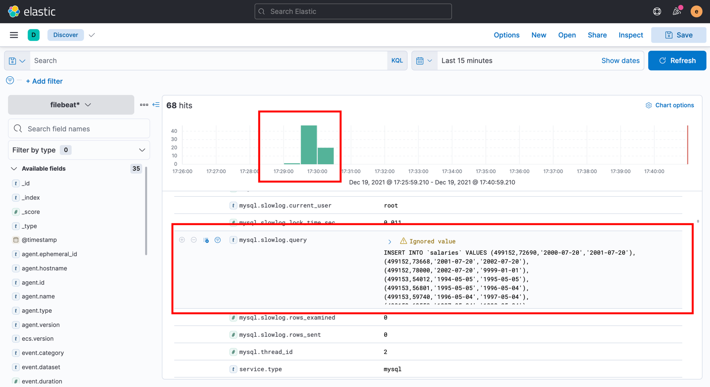
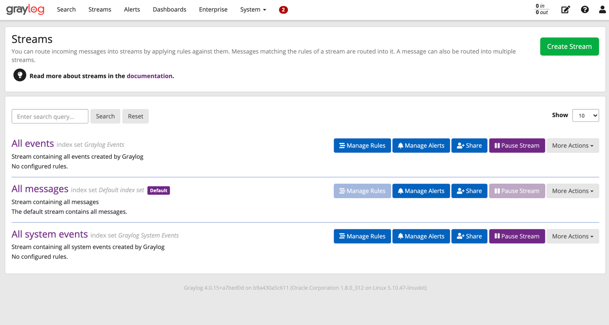
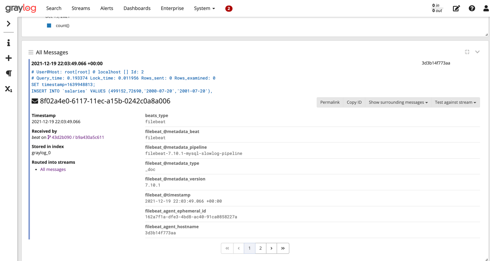

# log-readers
Read mysql slow query logs via ELK and GrayLog2

### Start all containers
`docker-compose up -d`

### Run Mysql init script to create sample data
- `make sample-mysql` - creates sample data
- `make-slow-logs` - run a query to make slow logs
- `make show-slow-logs` - check that slow logs exists

### Open Kibana to check mysql slow logs
- Open http://127.0.0.1:5601/
- Enter login `elastic` and password `admin`
- Create index pattern `filebeat*` - http://127.0.0.1:5601/app/management/kibana/indexPatterns
- Look for mysql slow logs - http://127.0.0.1:5601/app/discover#/?_g=(filters:!(),refreshInterval:(pause:!t,value:0),time:(from:now-30m,to:now))&_a=(columns:!(),filters:!(),index:'04be52a0-60e2-11ec-bc8f-4f3209720c05',interval:auto,query:(language:kuery,query:''),sort:!(!('@timestamp',desc)))
  

### Try GrayLog
- Open http://127.0.0.1:9201/
- Use `admin:admin` as username and password

  

- Create input http://127.0.0.1:9201/system/inputs with bind address `0.0.0.0` and port `5044`
- Uncomment logstash output in `./conf/filebeat/config/filebeat.yml`
- Click `Show received messages` and check loaded data

  
